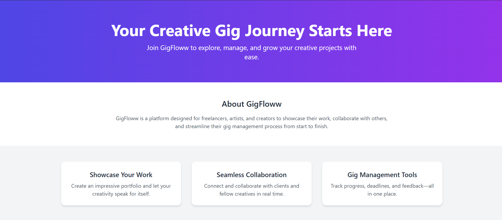

# GigFloww Landing Page

A clean, responsive static landing page for **GigFloww**, built with HTML and Tailwind CSS.

## 🚀 Features

- **Responsive Design**  
  Fully responsive layout that adapts to mobile, tablet, and desktop screens.
- **Hero Section**  
  Eye-catching headline and subheadline with gradient background.
- **About Section**  
  Brief introduction to GigFloww’s mission and value proposition.
- **Feature Highlights**  
  Three feature blocks showcasing:
  1. Showcase Your Work  
  2. Seamless Collaboration  
  3. Gig Management Tools
- **Call to Action**  
  Prominent “Join Now” button to drive conversions.
- **Footer**  
  Simple footer with copyright notice.

## 📄 Demo



## 💾 Installation

1. **Clone the repository**  
   ```bash
   git clone https://github.com/your-username/gigfloww-landing-page.git
   cd gigfloww-landing-page
